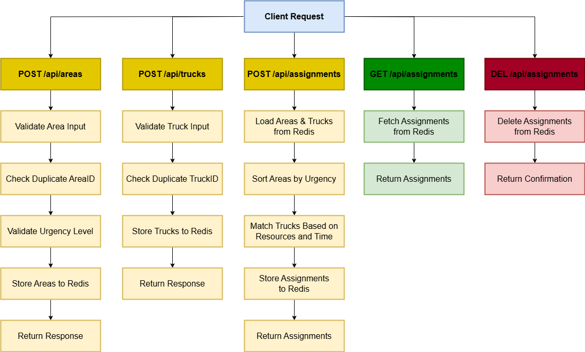

# Disaster Resource Allocation API by ptpofficialxd

## Live Demo
You can access the live demo of the API at: [Disaster Resource Allocation API Demo](https://ptpofficialxd.azurewebsites.net/)

## Problem Statement
The Disaster Resource Allocation API is designed to assist a Disaster Management Center in dynamically allocating emergency resources to areas affected by natural disasters. The primary goal is to prioritize resource distribution to areas with higher urgency and tighter constraints.

## Technologies Used
- **Bun**: For building the API.
- **Hono**: To handle routing and middleware.
- **Redis**: For caching assignment results to improve performance.
- **Azure**: For deploying the API and hosting the live demo.
- **Postman**: For testing API endpoints and ensuring functionality.
- **Fork**: For version control and managing commits.

## API Endpoints
1. **POST /api/areas**: Allows adding affected areas, with details such as urgency level, resources needed, and time constraints. 
2. **POST /api/trucks**: Allows adding resource trucks, with details about available resources and travel times to areas. 
3. **POST /api/assignments**: Processes and returns truck assignments for each area based on urgency, time constraints, and available resources.
4. **GET /api/assignments**: Returns the last processed assignments, retrieving them from a Redis cache if available.
5. **DELETE /api/assignments**: Clears the current assignment data from the cache.

## Input Data Structure
- **Affected Areas**:
  - Area ID: Unique identifier.
  - Urgency Level: Integer from 1 to 5.
  - Required Resources: Dictionary of resource type and amount needed.
  - Time Constraint: Hours within which resources must be delivered.
  
- **Resource Trucks**:
  - Truck ID: Unique identifier.
  - Available Resources: Dictionary of resource type and available amount.
  - Travel Time to Area: Dictionary of Area IDs and travel times (hours).

## Design Considerations
### Problem Interpretation
The challenge is to efficiently allocate resources to affected areas while considering urgency and constraints. The approach involves prioritizing areas based on urgency and ensuring that resources are allocated within the specified time limits.

### API Design Rationale
Each API endpoint is designed to handle specific operations, ensuring clarity and separation of concerns. This design allows for easy scalability and maintenance, accommodating future enhancements.

### Data Structure Design
Data is stored in Redis for quick access and retrieval. The schema is designed to facilitate efficient querying and ensure that the system can scale effectively as the number of requests increases.

### Visual Aids
To enhance understanding, diagrams such as flowcharts and sequence diagrams are provided below to illustrate the API workflow and data interactions.


## Installation
To install dependencies, run:
```bash
bun install
```

## Running the API
To run the API using Docker, execute:
```bash
docker-compose up --build
```

This project was created using `bun init` in bun v1.2.2. [Bun](https://bun.sh) is a fast all-in-one JavaScript runtime.
